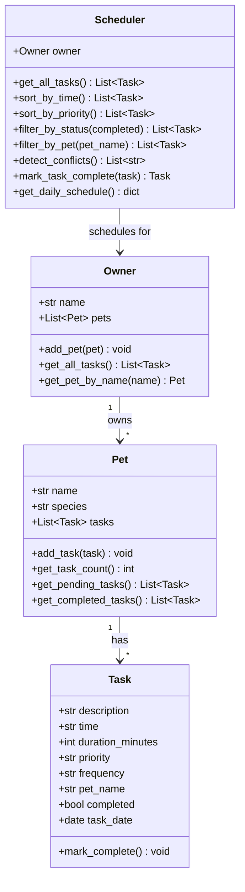

# PawPal+ -- Smart Pet Care Scheduling System

**PawPal+** is an intelligent pet care management tool that helps multi-pet owners organize daily care routines. It sorts tasks by time and priority, detects scheduling conflicts, automates recurring tasks, and provides both a CLI and a Streamlit web interface.

---

## Features

| Feature | Description |
|---|---|
| **Chronological Sorting** | Tasks sorted by `HH:MM` time for a clean daily schedule |
| **Priority Sorting** | High > Medium > Low ordering so critical care comes first |
| **Conflict Detection** | Flags tasks scheduled at the exact same time across pets |
| **Recurring Task Automation** | Completing a daily/weekly task auto-generates the next occurrence |
| **Filter by Pet** | View tasks for a single pet at a time |
| **Filter by Status** | Toggle between pending and completed tasks |
| **Streamlit Web UI** | Interactive dashboard with forms, tables, and one-click completion |
| **CLI Demo** | Terminal script to verify logic without the UI |

---

## Smarter Scheduling

PawPal+ goes beyond a simple to-do list by implementing algorithmic scheduling features. Tasks are sorted chronologically using Python's built-in `sorted()` with a key on the `HH:MM` time string, while priority sorting uses a weighted mapping (`high=0, medium=1, low=2`) as a composite sort key. Conflict detection groups tasks by time slot and flags any slot with more than one task. The recurrence engine uses `datetime.timedelta` to automatically generate the next daily (+1 day) or weekly (+7 day) task instance when the current one is marked complete.

---

## Getting Started

### Prerequisites
- Python 3.10+

### Setup

```bash
# Clone the repo
git clone https://github.com/lnsomniak/ai110-module2show-pawpal-starter.git
cd ai110-module2show-pawpal-starter

# Create and activate a virtual environment
python -m venv venv
source venv/bin/activate        # macOS/Linux
# venv\Scripts\activate         # Windows

# Install dependencies
pip install -r requirements.txt
```

---

## How to Run

### Streamlit Web App
```bash
streamlit run app.py
```

### CLI Demo
```bash
python main.py
```

---

## Testing PawPal+

```bash
python -m pytest
```

The test suite (`tests/test_pawpal.py`) covers:

- Task completion toggling
- Adding tasks to pets and verifying counts
- Chronological sort correctness
- Priority sort correctness
- Conflict detection (same-time tasks)
- Recurring task generation (daily and weekly)
- One-time task -- no recurrence
- Filtering by pet name
- Filtering by completion status
- Edge case: pet with no tasks
- Edge case: owner with no pets

**Confidence: 4/5 stars** -- Core logic is well-covered. Future tests would add duration-aware overlap detection and stress tests with many pets.

---

## Demo

> *Screenshot placeholder -- add a screenshot of the Streamlit UI here.*

---

## Tech Stack

- **Python 3.10+** -- core language with dataclasses
- **Streamlit** -- interactive web UI
- **pytest** -- automated test suite

---

## Project Structure

```
ai110-module2show-pawpal-starter/
|-- pawpal_system.py       # Core logic: Task, Pet, Owner, Scheduler classes
|-- main.py                # CLI demo script
|-- app.py                 # Streamlit web UI
|-- requirements.txt       # Python dependencies
|-- README.md              # This file
|-- reflection.md          # AI-assisted development reflection
+-- tests/
    |-- __init__.py        # Package init
    +-- test_pawpal.py     # pytest test suite
```

---

## UML Class Diagram


